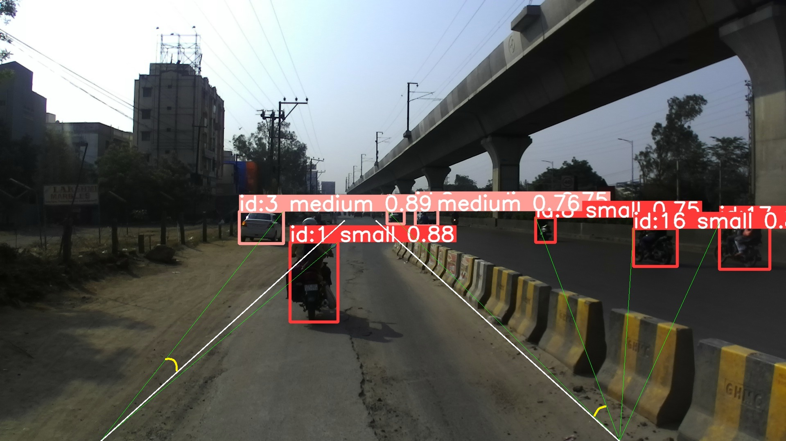

# Vehicle Cut-In Detection for Indian Driving Conditions

This project implements a vehicle cut-in detection system optimized for Indian driving conditions. It utilizes the YOLOv8 model for object detection and analyzes vehicle angles relative to lane markings to determine cut-in events.


This GIF demonstrates our vehicle cut-in detection system working on IDD-Multimodal dataset. [Click here](https://www.youtube.com/playlist?list=PLF2rfk7LtOyrXkF4xX1TGbQwL_Lam1DQL) for the full video demonstration.

## Features

- Vehicle detection using YOLOv8
- Cut-in event detection algorithm
- Optimized for Indian driving scenarios
- Trained on IDD-Detection dataset

## Requirements

- Python 3.8+
- PyTorch 2.0+
- OpenCV 4.0+
- Ultralytics

## Installation

1. Clone this repository:

    ```bash
    git clone https://github.com/Kaushal-Bora/Cut-In-Detection.git && cd Cut-In-Detection
    ```

2. Create virtual environment and install the required packages:

    ```bash
    python -m venv venv
    venv\Scripts\activate  # On Linux, use "source venv/bin/activate"
    pip install -r requirements.txt
    ```

## Usage

1. Run the detection:

    ```bash
    python cut_in_detection.py samples
    ```

## How It Works

Our vehicle cut-in detection algorithm combines YOLOv8 object detection with geometric analysis to identify cut-in events in Indian driving conditions. Here's an overview of the process:

### 1. Vehicle Detection
   - Our system employs a YOLOv8 model, fine-tuned on the IDD-Detection (India Driving Dataset) for robust vehicle detection in Indian traffic scenarios.
   - The IDD-Detection dataset comprises over 40,000 meticulously annotated images across 15 distinct labels, providing a rich foundation for training.
   - We've streamlined the detection classes to three categories based on vehicle height ($\text{m}$):
     
     - **Small ($1 \text{ m}$) -** Motorcycles and two-wheelers
     - **Medium ($1.6 \text{ m}$) -** Cars and autorickshaws
     - **Large ($4 \text{ m}$) -** Buses and trucks
   - This simplified classification system allows for:
     
     - Focused training on vehicle types most relevant to cut-in detection
     - Potentially improved model accuracy for our specific use case
     - Simplified post-processing and cut-in event analysis

   While reducing the number of classes doesn't significantly affect YOLOv8's inference time, as it primarily impacts the model's output layer, it does simplify our subsequent processing steps. Our model efficiently processes each frame of the input video, identifying and classifying vehicles according to these optimized categories, setting the stage for precise cut-in event analysis.

### 2. Lane Markings

   Given the unique challenges of Indian roads, where lane markings are often absent, faded, or inconsistent, we've developed a novel approach to establish reference points for vehicle angle calculations:

   *a) Static Lane Marking Syste*
   - Instead of relying on traditional lane detection algorithms, we use a static reference system.
   - This system is based on analysis of typical road structures in Indian driving conditions.

   *b) Lane Marking Placement*
   - Left and right lane markings are positioned at 33% (0.33) of the image width from the center at the bottom of the frame.
   - These reference lines converge as they extend upward in the image, mimicking perspective.
   - At the middle of the frame (representing the farthest visible point), the markings are positioned at 2% (0.02) of the image width from the center.
   <br><br>

   *c) Advantages of This Approach*
   - Consistency: Provides a stable reference even on roads with no visible lane markings.
   - Simplicity: Reduces computational overhead compared to dynamic lane detection.
   - Adaptability: Can be easily adjusted based on specific road types or camera setups.

   This static reference system allows our algorithm to calculate vehicle angles and detect cut-in events reliably, even in the challenging and diverse road conditions typical of Indian traffic scenarios.

### 3. Vehicle Metrics: Distance, Velocity, TTC, and Angle Calculation

   *a) Distance Calculation*
   
   &emsp;We use a pinhole camera model to estimate the distance to each detected vehicle:
   
<br>
<p align="center">
$\huge\textrm{Distance to object}(mm) = \frac{f(mm)\,\times\, \textrm{real height}(mm)\,\times\, \textrm{image height}(pixels)} {\textrm{object height}(pixels)\,\times\, \textrm{sensor height}(mm)}$
</p>
<br>
    
   Where:
   - $\textrm{f:}$ focal length (mm)
   - $\textrm{real height:}$ actual height of the vehicle (mm)
   - $\textrm{image height:}$ height of the entire image (pixels)
   - $\textrm{object height:}$ height of the vehicle in the image (pixels)
   - $\textrm{sensor height:}$ height of the camera sensor (mm)

   *b) Relative Velocity Calculation*
   - We calculate the relative velocity by measuring the change in distance over consecutive frames.
   - To ensure robustness against momentary fluctuations, we store velocity data for the last 5 image frames.
   - The median velocity of these 5 frames is used as our final velocity estimate.

   *c) Time to Collision (TTC) Estimation*
   - Using the calculated distance and the median relative velocity, we estimate the Time to Collision (TTC).
   - This TTC value is crucial for our cut-in detection algorithm, helping to identify potentially hazardous situations.

   *d) Angle Calculation*
   - For each detected vehicle, we calculate its relative orientation with respect to the reference lane markings. This angle is determined by the slope of the reference line and the line formed between the reference line's origin and the top-right corner of the vehicle's bounding box.
   <br><br>

### 4. Cut-In Determination

   Our algorithm identifies a cut-in event by analyzing the dynamic behavior of vehicles relative to lane markings. The detection process involves the following key components:

   *a) Temporal Analysis*
   - We examine vehicle behavior over a short window of 5 consecutive frames.
   - This approach allows us to capture rapid changes in vehicle positioning and orientation.

   *b) Cut-in Criteria*
   - Angle Variation: The standard deviation of the vehicle's angle relative to lane markings must exceed 1.5 degrees over the 5-frame window. This threshold captures significant directional changes indicative of a cut-in maneuver.
   - Time-to-Collision (TTC): The estimated TTC must be less than 0.8 seconds. This criterion ensures we focus on imminent and potentially hazardous cut-in events.

   *c) Vehicle Tracking and Risk Assessment*
   - Any vehicle with a TTC less than 3 seconds is flagged for close monitoring.
   - These flagged vehicles are tracked for an extended period of 30 frames.
   - Visual Feedback: The tracking marker's color dynamically changes based on the current TTC value, providing an intuitive representation of risk level.
   <br><br>

   *d) Cut-In Event Flagging*
   - When a vehicle satisfies the cut-in criteria, it is immediately flagged as a cut-in event.
   - Visual Indicator: A prominent "CUT-IN" text is displayed directly over the vehicle in the video frame.
   - This text appears in addition to the color-coded tracking marker, providing clear and immediate identification of cut-in events.
   <br><br>

   This comprehensive approach allows our system to accurately detect, flag, and visually indicate cut-in events in real-time. By combining dynamic analysis with clear visual feedback, we ensure reliable performance and easy interpretation of results in the complex and dynamic environment of Indian roads.
